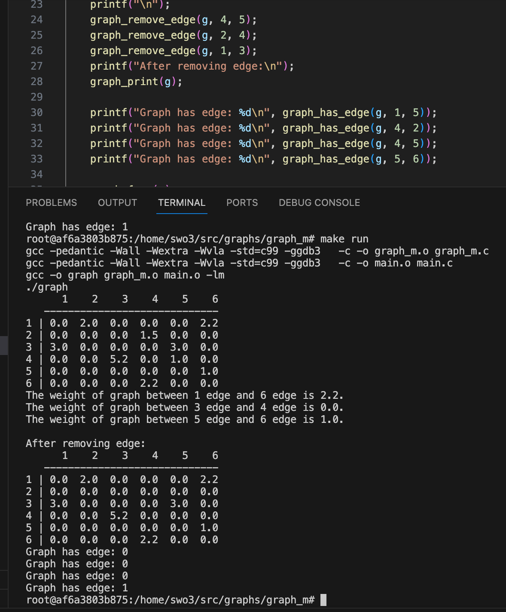
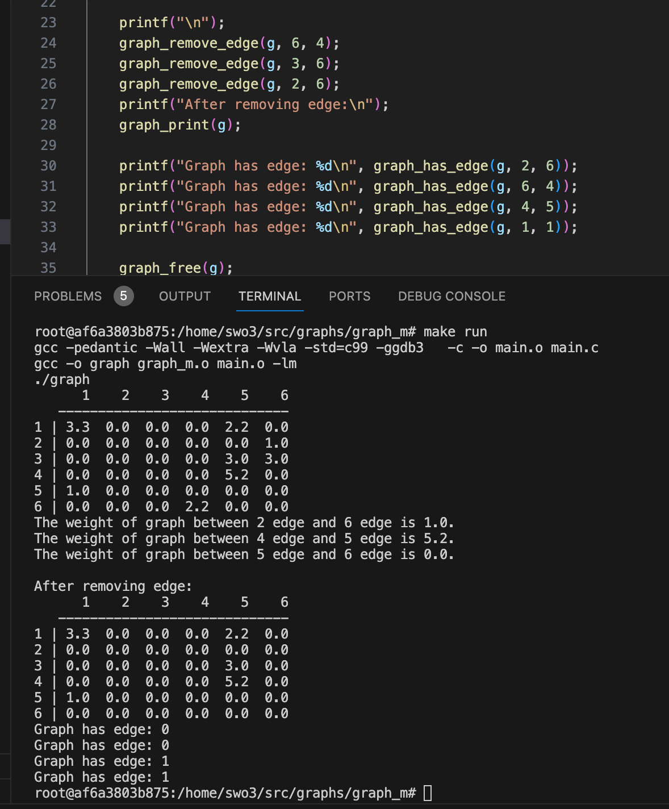
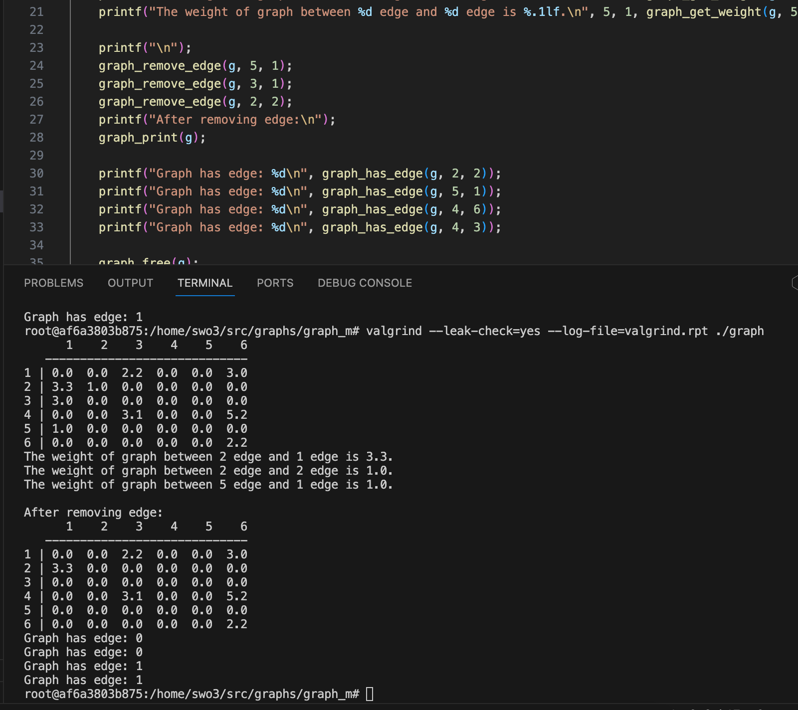
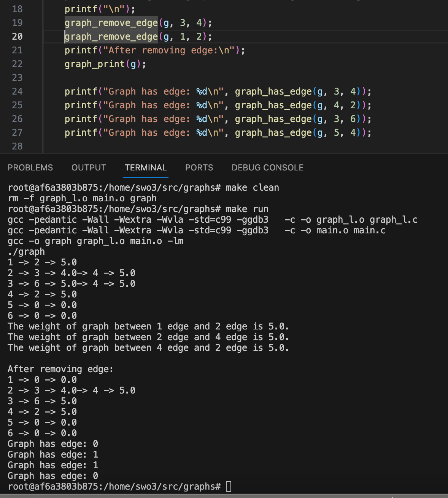
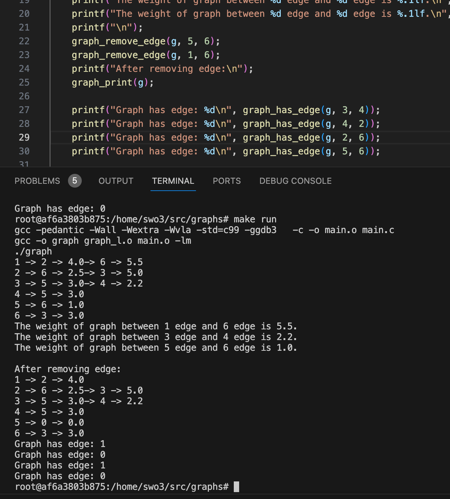
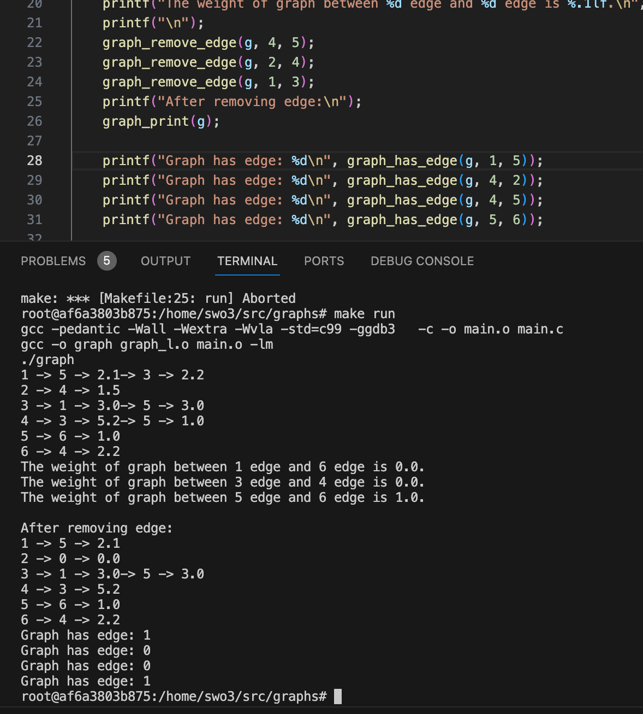
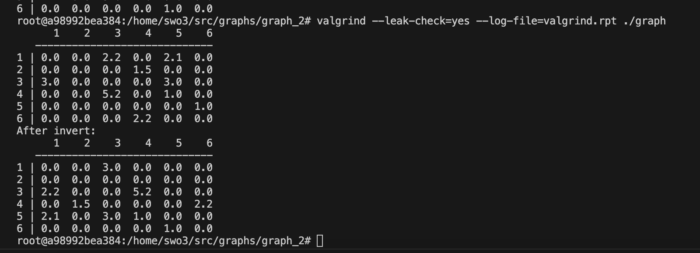
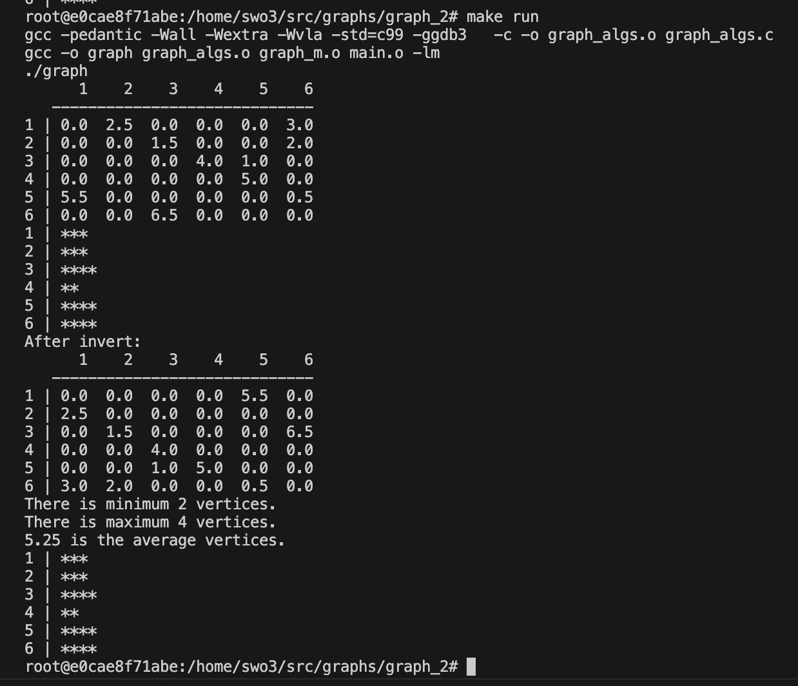

# Übung 3 - Lösung

## 1. Repräsentation von Graphen (src/graphs)

### Lösungsidee
a. 1. Function graph_create
Für Adjazenzmatrix wird ein 1D array erstellt. Um Speicher dynamisch vom Heap anzufordern wird Funktion malloc verwendet und mit 0 initialisiert.
2. Function graph_free
Speicher wird freigegeben.
3. Function graph_insert_edge
Source und target werden vermindert, weil Array mit 0 beginnt. Wenn gegebene index frei ist, dann wird an dieser Stelle weight gespeichert.
4. Function graph_remove_edge
Wenn Function graph_has_edge false liefert, wird return aufgerufen. Wenn true, dann werden Source und target vermindert und an gegebene index 0 gespeichert.
5. Function graph_has_edge
Source und target werden vermindert. Wenn gegebene index frei ist, dann wird return value false. Wenn an diese Stelle nicht 0 ist, dann liefert Function true.
6. Function graph_get_weight
Wenn Function graph_has_edge false liefert, wird return value 0. Wenn true, dann wird Source und target vermindert und  wird der wert an der gesuchte index als return value.
7. Function graph_print
Array wird ausgegeben.

b. 1. Function graph_create
Für Adjazenzliste wird wird Funktion malloc verwendet, um Speicher dynamisch vom Heap anzufordern. Die edge und target wird mit 0, next mit NULL initialisiert.
2. Function graph_free
Mit einem For Schleife wird Speicher freigegeben und auf Null gesetzt.
3. Function graph_insert_edge
Source wird vermindert. Wenn gegebene Stelle frei ist, dann wird an dieser Stelle weight gespeichert. Wenn die Stelle nicht frei ist, dann wird neue Knoten hinzugefügt und weight, target in diese Knoten gespeichert.
4. Function graph_remove_edge
Wenn Function graph_has_edge false liefert, wird return aufgerufen. Wenn true, dann wird Source vermindert und geprüft ob an gegebene index gesuchte target gespeichert ist oder nicht. Wenn 
gesuchte target gefunden wird, dann wird auf 0 gesetzt. Wenn eine Liste in next gespeichert ist, dann wird in diese Liste target gesucht. Falls target schon es gibt, dann wird freigegeben.
5. Function graph_has_edge
Source wird vermindert. Wenn gegebene index frei ist, dann wird return value false. Wenn an diese Stelle target ist, dann liefert Function true. oder wird in Liste gesucht.
6. Function graph_get_weight
Wenn Function graph_has_edge false liefert, wird return value 0. Wenn true, dann wird Source vermindert und  wird der wert an der gesuchte index als return value. oder wird in Liste gesucht.
7. Function graph_print
Adjazenzliste wird ausgegeben.

### Implementierung
Für beide programm habe ich die gleiche h datei, main.c und makefile verwendet. Für Tests habe ich irgendwelches zahlen verwendet.
siehe code.

### Tests
1a.

1b.

## 2. Graphen-Algorithmen (src/graphs) 

### Lösungsidee
1. Function graph_invert
Neue Array wird erstellt, um die nvertierte Werte zu speichern. Mit For Schleife wird gefunden, wo die werte gespeichert sind und in neue Array in andere index wird gespeichert. Also alle Kanten werden umgedreht.
2. Function graph_get_degree
Als minimum Anzahl wird 11 definiert, um in for Schleife mit gezählte count zu vergleichen, weil in diesem graph nicht mehr als 11 Kanten sein kann. 
Mit for Schleife wird die Anzahl von Kanten(outgoing und incoming) von jedem Knoten gezählt und vergleicht welche Knoten weniger und welche mehr hat. Wenn Funtion parameter - input 1 ist, wird die wenigste Anzahl return value und wenn input 0 ist, wird maximum Anzahl return value.
3. Function graph_min_degree
Funktionirt Function graph_get_degree (input = 1), liefert minimum degree.
4. Function graph_max_degree
Funktionirt Function graph_get_degree (input = 0), liefert maximum degree.
5. Function graph_avg_degree
Mit for Schleife wird alle Grade summieren und durch die Anzahl der Knoten dividieren.
6. graph_print_degree_histogram
Alle Grade werden als * ausgegeben.

### Implementierung
graph.h, graph_m.c(in diese Aufgabe werwendete ich matrix) und gleiche makefile habe ich benutzt.
von pdf file graph habe ich so verstanden dass die Richtung und das Gewicht für den Grad irrelevant sind. Mit diesem Idee habe ich zweite Aufgabe so gemacht.
siehe code.

### Tests

